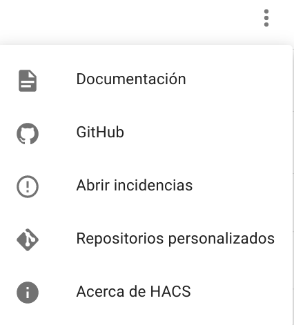
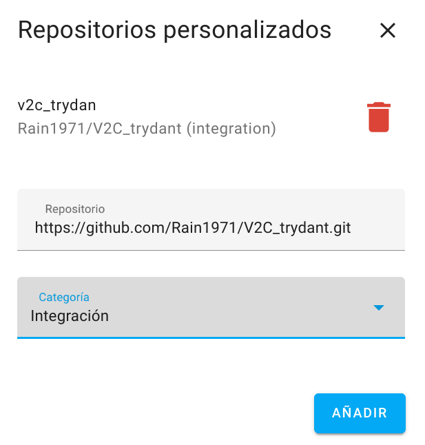
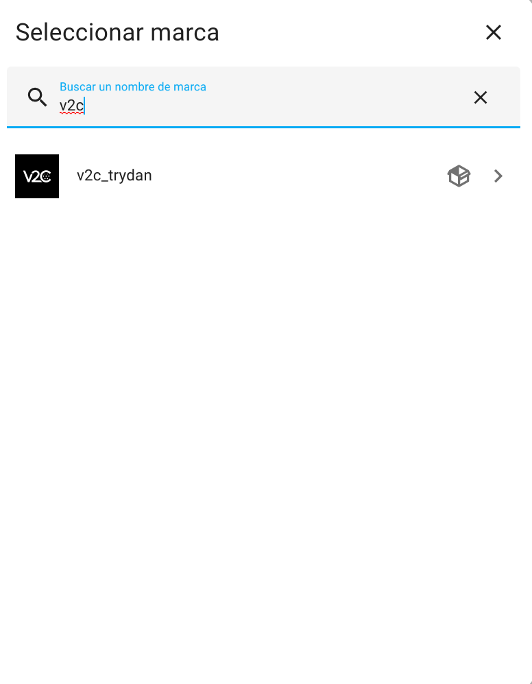
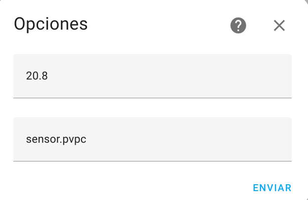
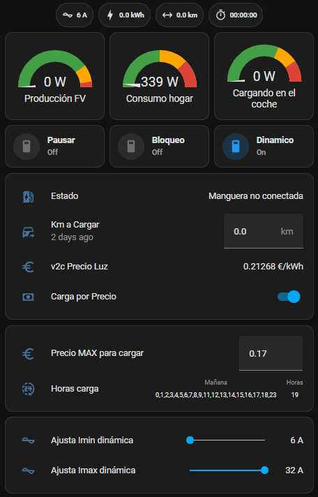

# CAR CHARGER V2C trydan component for HOME ASSISTANT

[](https://github.com/hacs/integration)
[](https://GitHub.com//Rain1971/V2C_trydant/releases/)
[](https://github.com/Rain1971/V2C_trydant/blob/main/README.md)
[](https://github.com/Rain1971/V2C_trydant/blob/main/README.es.md)

This integration exposes the information and functions made available by [V2C trydan](https://v2charge.com/trydan/) directly via http interface in Home Assistant.

# Prerequisites

This integration supports network connection to V2C trydan directly, so that take note of the V2C trydan static IP address previously. 

For a later configuration, you need to know the electrical consumption data of your car expressed in Kwh per 100 km

If you want to use the price-based load control feature, you must install the following integrations for lovelace, from HACS:
- [PVPC Hourly Pricing Card](https://github.com/danimart1991/pvpc-hourly-pricing-card) 
- [multiple-entity-row](https://github.com/benct/lovelace-multiple-entity-row)


# Setup:

* Add this repository in HACS ( [https://github.com/Rain1971/V2C_trydant.git](https://github.com/Rain1971/V2C_trydant.git) )





* Restart Home Assistant
* Go to Configuration -> Integrations -> Add Integration



* Add integration and put there your device IP
* Go to the v2C integration. Now, there are 28 entities. Press on settings and set:
   - kWh x 100Km of your car (default: 20.8 kWh/100km)
   - Sensor.pvpc  ->( add this only if you want to control your car charge based on the price of electricity. See PVPC Hourly Pricing Card )
   - Car battery capacity (defaut: 75 kWh)
   
* Press 'Send' and it create a new entity: sensor.v2c_precio_luz. Now there are 29 entities.
* Restart Home Assistant
# Entities:

The following entities are created:  

| Name                               | Type    | R/W  | Units        | Description                                    |
| :--------------------------------- | :------ | :--- | :----------- | :--------------------------------------------- |
| v2c_trydan_sensor_chargeenergy     | Sensor | R   | N kWh      | Current charging session energy in kWh.        
| v2c_trydan_sensor_chargekm  v2c_km_to_charge        | Sensor Number   | R \ W | N km     | Current charging session energy in Km.
| v2c_trydan_sensor_chargepower      | Sensor | R   | N W        | Current charging power in Watts.
| v2c_trydan_sensor_chargestate      | Sensor | R   | S `values`    | Charge Point. Spanish string States: `Manguera no conectada`, `Manguera conectada (NO CARGA)`,`Manguera conectada (CARGANDO)`
| v2c_trydan_numericalstatus         | Sensor | R   | N `values`    | Charge Point. Numerical Status: `0`-Hose Not connected, `1`-Hose Connected (BUT NOT CHARGING),`2`-Hose Connected (CHARGING)
| v2c_trydan_sensor_chargetime       | Sensor | R   | N s        | Current charging session time. 
| v2c_trydan_sensor_contractedpower  | Sensor | R   | N W        | House Contracted Power in Watts. Default `-1`
| vc2_trydan_sensor_dynamic          | Sensor | R   | N `values`    | Dynamic Intensity Modulation state: `0`-Disabled, `1`-Enabled
| vc2_trydan_sensor_dynamicpowermode | Sensor | R   | N `values`    | Dynamic Mode: 0 Timed Power enabled; `1`-Timed Power Disabled, `2`-Timed Power Disabled and Exclusive Mode setted, `3`-Timed Power Disabled and Min Power Mode setted, `4`-Timed Power Disabled and Grid+FV mode setted, `5`-Timed Power Disabled and Stop Mode setted
| vc2_trydan_sensor_fvpower          | Sensor | R   | N W        | Photovoltaic power generation in Watts.
| vc2_trydan_sensor_housepower       | Sensor | R   | N W        | House power consumption in Watts.
| v2c_trydan_sensor_intensity \   v2c_intensity      | Sensor Number | R \ W | N A        | Intensity offered by Charge Point in Amps, **if Dynamic Charge is disabled**. 
| v2c_trydan_sensor_locked           | Sensor | R   | N `values`    | Disabling state of Charge Point: `0`-Enabled, `1`-Disabled 
| v2c_trydan_sensor_maxintensity  v2c_max_intensity   | Sensor Nuber   | R \ W | N A        | Intensity offered maximun limit in Amps, **if Dynamic Charge is enabled**. (max default 32A)
| v2c_trydan_sensor_minintensity  v2c_min_intensity     | Sensor Number | R \ W | N A        | Intensity offered minimun limit in Amps, **if Dynamic Charge is enabled**. (max default 6A)
| v2c_trydan_sensor_paused           | Sensor | R   | N `values`    | Pause state of current charging session: `0`-Enabled, `1`-Disabled                
| v2c_trydan_sensor_pausedynamic     | Sensor | R   | N `values`    | Dynamic Control Modulation Pause State: `0`-Modulating, `1`-No Modulating
| v2c_trydan_sensor_slaveerror       | Sensor | R   | N `values`    | Slave communication state: `0`-No error, `1`-error message, `2`-Communication error
| v2c_trydan_sensor_timer            | Sensor | R   | N `values`    | Charge Point Timer state: `1`-Timer ON, `0`-Timer OFF
| v2c_precio_luz                     | Sensor | R   | state `attributes` | Data retrieved from api.esios.ree.es by REE. The `state` contains the current price and also these attributes: `state_class`, `measurement`, `tariff`, `period`, `available_power`, `next_period`, `hours_to_next_period`, `next_better_price`, `hours_to_better_price`,  `num_better_prices_ahead`, `price_position`, `price_ratio`, `max_price`, `max_price_at`, `min_price`, `min_price_at`, `next_best_at`, `price_00h` to `price_23h`, `unit_of_measurement`, `attribution`, `icon`, `friendly_name`, `ValidHours` (show at what times it will charge today with that maximum price), `ValidHoursNextDay` (show at what times it will charge tomorrow with that maximum price) and `TotalHours` (contains the total number of charging hours). These last two values are updated every 30 seconds and only if number.v2c_maxprice > 0 
| vc2_trydan_switch_dynamic          | Switch | R/W | `on` `off`    | Toggle to dynamic charge. Default `off`                       
| v2c_trydan_switch_paused           | Switch | R/W | `on` `off`    | Toggle to pause charge. Default `off`                        
| v2c_trydan_switch_locked           | Switch | R/W | `on` `off`    | Toggle to block the charger. Default `off`
| v2c_trydan_switch_v2c_carga_pvpc   | Switch | R/W | `on` `off`    | Toggle whether or not you want to charge while limiting by PVPC price . Default `off`
| v2c_trydan_switch_v2c_smart_charge | Switch | R/W | `on` `off`    | Toggle whether or not you want to charge using the smart charge algorithm, which takes into account: current battery charge percentage, available charging power, assumes that battery must be at 80% within the following 12 hours. With all this information it will select the cheapest hours according to PVPC to charge the car. Default `off`


# Events:

The following events are created:  

| Event                              | Description                                   |
| :--------------------------------- |:--------------------------------------------- |
| v2c_trydan.charging_complete       | Event triggered when the energy corresponding to the selected kilometers has been charged. 

# Examples:
* You can also use a automation to check when device has changed the Km set:
```
alias: CARGA COCHE COMPLETA
description: CARGA COMPLETA
trigger:
  - platform: event
    event_type: v2c_trydan.charging_complete
action:
  - service: notify.notify
    data:
      message: La carga del vehículo ha alcanzado el límite de kilómetros.
  - service: notify.pushover
    data:
      message: KM del coche CARGADOS
      title: CARGADOR!
      data:
        priority: 1
    enabled: true
mode: single
```

# SCREEN Examples:

* Use [example.yaml](https://raw.githubusercontent.com/Rain1971/V2C_trydant/main/lovelance/example.yaml)
* For pvpc Control [example_pvpc.yaml](https://raw.githubusercontent.com/Rain1971/V2C_trydant/main/lovelance/example_pvpc.yaml)
* For pvpc Control, compacted version [example_pvpc_compact.yaml](https://raw.githubusercontent.com/Rain1971/V2C_trydant/main/lovelance/example_pvpc_compact.yaml)


